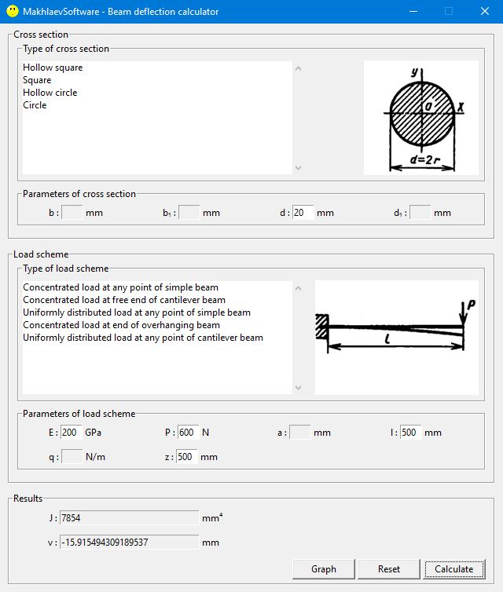
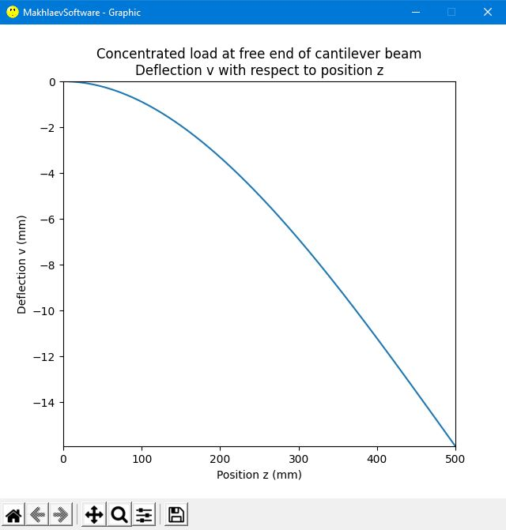

# Beam deflection calculator

This program allows you to calculate moment of inertia and beam deflection for various types of cross sections and load schemes respectively. You can see its graphical user interface on depiction down below:

<br/>

Also it plots a graph of beam deflection via its length. An example of the graph is shown below:

<br/>

## Usage

Download the project folder on your machine in any convenient way.

### Windows

Download and install the [Python 3.6+ interpreter](https://www.python.org/downloads/), don't forget to add it to **PATH**, then open a command prompt in the project directory and type:

```bash
pip install -r requirements.txt
```

after that to launch the program type the following:

```bash
python main.py
```

Congratulations! Now you can enjoy your calculations.